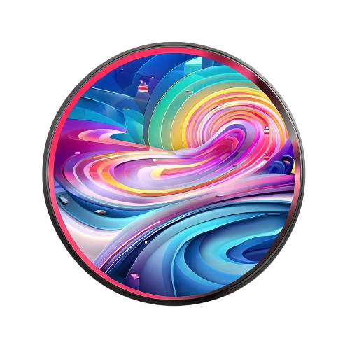

<p align="center">
    
</p>

# DreamJourney: Perpetual View Generation with Video Diffusion Models (TMM 2025)

<div align="center">

[](https://dream-journey.vercel.app/)
[](https://arxiv.org/abs/2312.03884)
</div>


## Getting Started

### Installation
For the installation to be done correctly, please proceed only with CUDA-compatible GPU available (tested with NVIDIA A40 40GB, NVIDIA A100 80GB, NVIDIA A800 80GB). 

Clone the repo and create the environment:
```bash
git clone https://github.com/bopan3/DreamJourney_CodeRelease
cd DreamJourney_CodeRelease
mamba create --name dreamjourney_15 python=3.10
mamba activate dreamjourney_15
```

Run the following commands to install pytorch3D or follow their <a href="https://github.com/facebookresearch/pytorch3d/blob/main/INSTALL.md" target="_blank">installation guide</a> (it is recommand to use mamba instead of conda for faster installation).
```bash
mamba install "pytorch-gpu==cuda118" torchvision -c conda-forge
mamba install -c iopath iopath
mamba install pytorch3d -c pytorch3d
```

Install the rest of the requirements:

```bash
mamba install transformers diffusers accelerate
mamba install matplotlib scikit-image opencv av spacy -c conda-forge
pip install openai==0.28.1
pip install timm==0.6.12
pip install pillow==9.2.0
pip install kornia
pip install einops
pip install httpx
pip install tenacity
pip install omegaconf
pip install botocore
```

Load English language model for spacy:

```bash
python -m spacy download en_core_web_sm
```

Download Midas DPT model and put it to the root directory.

```bash
wget https://github.com/isl-org/MiDaS/releases/download/v3_1/dpt_beit_large_512.pt
```

Set up independent environment for [EasyAnimate](https://github.com/aigc-apps/EasyAnimate) (which is used as video prior model):

```bash
## enter EasyAnimate's dir
cd video_prior_models/EasyAnimate

## download weights
mkdir models/Diffusion_Transformer
mkdir models/Motion_Module
mkdir models/Personalized_Model

wget https://pai-aigc-photog.oss-cn-hangzhou.aliyuncs.com/easyanimate/Diffusion_Transformer/EasyAnimateV3-XL-2-InP-512x512.tar -O models/Diffusion_Transformer/EasyAnimateV3-XL-2-InP-512x512.tar

cd models/Diffusion_Transformer/
tar -xvf EasyAnimateV3-XL-2-InP-512x512.tar
cd ../../

## create environment for easyAnimate
conda create -n easyAnimate python=3.10
conda activate easyAnimate
pip install torch==2.2.1 torchvision==0.17.1 torchaudio==2.2.1 --index-url https://download.pytorch.org/whl/cu121
pip install -r requirements.txt
pip install diffusers["torch"] transformers
pip install accelerate
pip install -e ".[torch]"

## install ffmpeg
apt-get update
apt-get install ffmpeg

## go back to DreamJourney folder
cd ../../
```

Set your OpenAI api_key at LLM_CONFIG/llm_config.yaml:

```yaml
APIKEY: "your_api_key_here"
API_BASE: "your_api_base_here"
API_MODEL_NAME: "your_api_model_name_here"
```


### Run examples 

- Run minimal example (run one short camera trace under one theme)

```bash
sh ./run_single_demo.sh
```
(check the generated video (in mp4 format) in ./output)

- Run all examples (run long camera trace under all theme collected by [WonderJounrey](https://github.com/KovenYu/WonderJourney/tree/main))
```bash
sh ./run_all_demo.sh
```
(check the generated videos (in mp4 format) in ./output)
